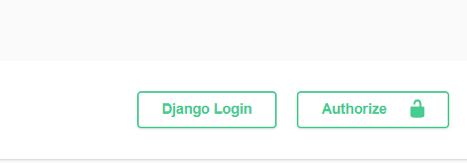

# mini-store

Welcome to **mini-store**! Follow these steps to get started:

## 1. Sign Up

- Go to [`auth/signup/`](auth/signup/) to create a new account.

## 2. Log In

- Use your credentials to log in at [`auth/login/`](auth/login/).

## 3. Get Your Access Token

- After a successful login, copy the `access` token from the response.

## 4. Authorize Requests

- Click on **Authorize** in your API client.

- Enter `Bearer <your_access_token>` as the authorization header.

## 5. Explore Endpoints

- Once authorized, you can interact with the available API endpoints.

For more information, see the [Example Domain documentation](https://www.iana.org/domains/example).